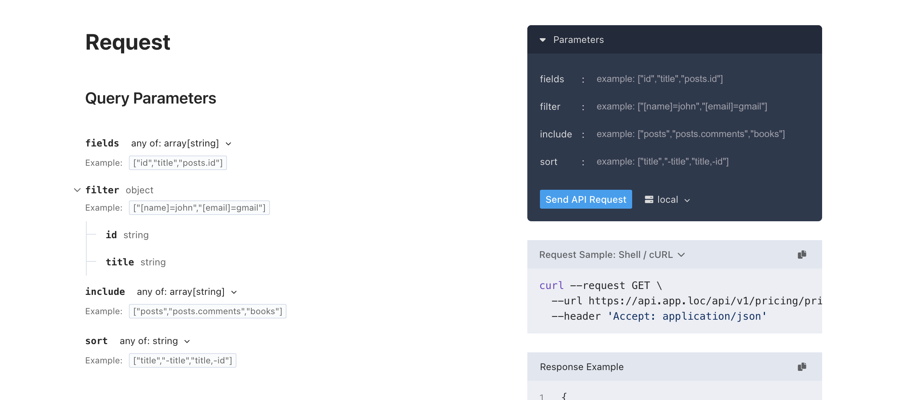

# Scramble extension for Spatie Query Builder


## Introduction
This is the Scramble extension, which detects the usage of the Spatie query builder in your api routes and automatically adds applicable query parameters to the openapi definitions.

## Installation

```
composer install laya/scramble-query-builder
```

## Usage
In your `config/scramble.php`
```php
'extensions' => [
    // ...
    \Laya\ScrambleQueryBuilder\Extension::class
],
```
## Customization
In your ```AppServiceProvider.php```
```php
public function boot(): void
    {
        // ...
        Extension::hook(function(Operation $operation, Parameter $parameter, \Laya\ScrambleQueryBuilder\QueryBuilderFeature $feature) {
            if($feature->getMethodName() === 'allowedIncludes') {
                // Provide your own examples
                $parameter->example(['repositories.issues', 'repositories']);
                // Provide your own description
                $parameter->description('Allows you to include additional model relations in the response');
            }
            
            if($feature->getMethodName() === 'allowedSorts') { 
                // ...
            }
            
            if($feature->getMethodName() === 'allowedFields') {
                // ...
            }
            
            if($feature->getMethodName() === 'allowedFilters') {
                // ...
            }
        });
    }
```
